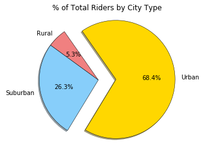

## Pyber Ride Sharing

## Analysis 

Over 2/3 of total revenue is driven by urban areas.
 
Number of rides and average fare appears to have a negative relationship.  Less drivers leads to lower revenue.  

Rural areas have less drivers and riders.   Number of drivers increase with assumed population increase.  Urban tops out in all categories.  


```python
import pandas as pd
import numpy as np
import matplotlib.pyplot as plt
% matplotlib inline
```


```python
ls
```

    PyBear MCM.ipynb  Untitled.ipynb    city_data.csv     ride_data.csv


```python
city_df = pd.read_csv('city_data.csv')
ride_df = pd.read_csv('ride_data.csv')
```


```python
merged_df = pd.merge(ride_df, city_df, how="left", on="city")
```


```python
merged_df.head()
```


<div>
<style scoped>
    .dataframe tbody tr th:only-of-type {
        vertical-align: middle;
    }

    .dataframe tbody tr th {
        vertical-align: top;
    }

    .dataframe thead th {
        text-align: right;
    }
</style>
<table border="1" class="dataframe">
  <thead>
    <tr style="text-align: right;">
      <th></th>
      <th>city</th>
      <th>date</th>
      <th>fare</th>
      <th>ride_id</th>
      <th>driver_count</th>
      <th>type</th>
    </tr>
  </thead>
  <tbody>
    <tr>
      <th>0</th>
      <td>Lake Jonathanshire</td>
      <td>2018-01-14 10:14:22</td>
      <td>13.83</td>
      <td>5739410935873</td>
      <td>5</td>
      <td>Urban</td>
    </tr>
    <tr>
      <th>1</th>
      <td>South Michelleport</td>
      <td>2018-03-04 18:24:09</td>
      <td>30.24</td>
      <td>2343912425577</td>
      <td>72</td>
      <td>Urban</td>
    </tr>
    <tr>
      <th>2</th>
      <td>Port Samanthamouth</td>
      <td>2018-02-24 04:29:00</td>
      <td>33.44</td>
      <td>2005065760003</td>
      <td>57</td>
      <td>Urban</td>
    </tr>
    <tr>
      <th>3</th>
      <td>Rodneyfort</td>
      <td>2018-02-10 23:22:03</td>
      <td>23.44</td>
      <td>5149245426178</td>
      <td>34</td>
      <td>Urban</td>
    </tr>
    <tr>
      <th>4</th>
      <td>South Jack</td>
      <td>2018-03-06 04:28:35</td>
      <td>34.58</td>
      <td>3908451377344</td>
      <td>46</td>
      <td>Urban</td>
    </tr>
  </tbody>
</table>
</div>


```python
urban_df = merged_df[merged_df["type"] == "Urban"]
suburban_df = merged_df[merged_df["type"] == "Suburban"]
rural_df = merged_df[merged_df["type"] == "Rural"]
```


```python
urban_df.head()
```


<div>
<style scoped>
    .dataframe tbody tr th:only-of-type {
        vertical-align: middle;
    }

    .dataframe tbody tr th {
        vertical-align: top;
    }

    .dataframe thead th {
        text-align: right;
    }
</style>
<table border="1" class="dataframe">
  <thead>
    <tr style="text-align: right;">
      <th></th>
      <th>city</th>
      <th>date</th>
      <th>fare</th>
      <th>ride_id</th>
      <th>driver_count</th>
      <th>type</th>
    </tr>
  </thead>
  <tbody>
    <tr>
      <th>0</th>
      <td>Lake Jonathanshire</td>
      <td>2018-01-14 10:14:22</td>
      <td>13.83</td>
      <td>5739410935873</td>
      <td>5</td>
      <td>Urban</td>
    </tr>
    <tr>
      <th>1</th>
      <td>South Michelleport</td>
      <td>2018-03-04 18:24:09</td>
      <td>30.24</td>
      <td>2343912425577</td>
      <td>72</td>
      <td>Urban</td>
    </tr>
    <tr>
      <th>2</th>
      <td>Port Samanthamouth</td>
      <td>2018-02-24 04:29:00</td>
      <td>33.44</td>
      <td>2005065760003</td>
      <td>57</td>
      <td>Urban</td>
    </tr>
    <tr>
      <th>3</th>
      <td>Rodneyfort</td>
      <td>2018-02-10 23:22:03</td>
      <td>23.44</td>
      <td>5149245426178</td>
      <td>34</td>
      <td>Urban</td>
    </tr>
    <tr>
      <th>4</th>
      <td>South Jack</td>
      <td>2018-03-06 04:28:35</td>
      <td>34.58</td>
      <td>3908451377344</td>
      <td>46</td>
      <td>Urban</td>
    </tr>
  </tbody>
</table>
</div>


```python
urban_avg_fare = urban_df.groupby("city").mean()["fare"]
urban_driver_count = urban_df.groupby("city").mean()["driver_count"]
urban_ride_count = urban_df.groupby("city").count()["ride_id"]

suburban_avg_fare = suburban_df.groupby("city").mean()["fare"]
suburban_driver_count = suburban_df.groupby("city").mean()["driver_count"]
suburban_ride_count = suburban_df.groupby("city").count()["ride_id"]

rural_avg_fare = rural_df.groupby("city").mean()["fare"]
rural_driver_count = rural_df.groupby("city").mean()["driver_count"]
rural_ride_count = rural_df.groupby("city").count()["ride_id"]
```

## Bubble Plot


```python
plt.scatter(x=urban_ride_count, y=urban_avg_fare, s=10*urban_driver_count, 
            c='coral', marker='o', edgecolor='black', 
            linewidth=1, alpha = 0.75, label="Urban")

plt.scatter(x=suburban_ride_count, y=suburban_avg_fare, s=10*suburban_driver_count, 
            c='skyblue', marker='o', edgecolor='black', 
            linewidth=1, alpha = 0.75, label="Suburban")

plt.scatter(x=rural_ride_count, y=rural_avg_fare, s=10*rural_driver_count, 
            c='gold', marker='o', edgecolor='black', 
            linewidth=1, alpha = 0.75, label="Rural")

plt.legend(loc="best")
plt.xlabel("Ride Count Per City")
plt.ylabel("Avg Fare Per City ($)")
```


    Text(0,0.5,'Avg Fare Per City ($)')


```python
color_scheme = {'Gold':'#FFD700', 'Light Sky Blue':'#87CEFA', 'Light Coral':'#F08080'}

city_color = {'Urban': color_scheme['Gold'], 'Suburban': color_scheme['Light Sky Blue'], 'Rural': color_scheme['Light Coral']}

colors = [city_color[n] for n in labels]
explode = [0 , 0, .3]

```


```python
total_rides = merged_df["ride_id"].nunique()
```


```python
#total fares
total_fare_count = merged_df.groupby("type").sum()["fare"]
total_fare_count

```


    type
    Rural        4327.93
    Suburban    19356.33
    Urban       39854.38
    Name: fare, dtype: float64


```python
labels = total_fare_count.index
plt.pie(total_fare_count, startangle = 125, explode = explode, colors = colors, labels = labels, autopct = "%1.1f%%", shadow = True, wedgeprops = {'linewidth': .5, 'edgecolor': 'black'})
plt.title('% of Total Fare by City Type')
plt.axis('equal')
plt.show()
```


```python
#total drivers

total_driver_count = merged_df.groupby("type").sum()["driver_count"]
total_driver_count

labels = total_driver_count.index
plt.pie(total_driver_count, startangle = 125, explode = explode, colors = colors, labels = labels, autopct = "%1.1f%%", shadow = True, wedgeprops = {'linewidth': .5, 'edgecolor': 'black'})
plt.title('% of Total Drivers by City Type')
plt.axis('equal')
plt.show()
```


```python
# total rides
total_ride_count = merged_df.groupby("type").count()["ride_id"]
total_ride_count

```


    type
    Rural        125
    Suburban     625
    Urban       1625
    Name: ride_id, dtype: int64


```python
labels = total_ride_count.index
plt.pie(total_ride_count, startangle = 125, explode = explode, colors = colors, labels = labels, autopct = "%1.1f%%", shadow = True, wedgeprops = {'linewidth': .5, 'edgecolor': 'black'})
plt.title('% of Total Riders by City Type')
plt.axis('equal')
plt.show()
```




